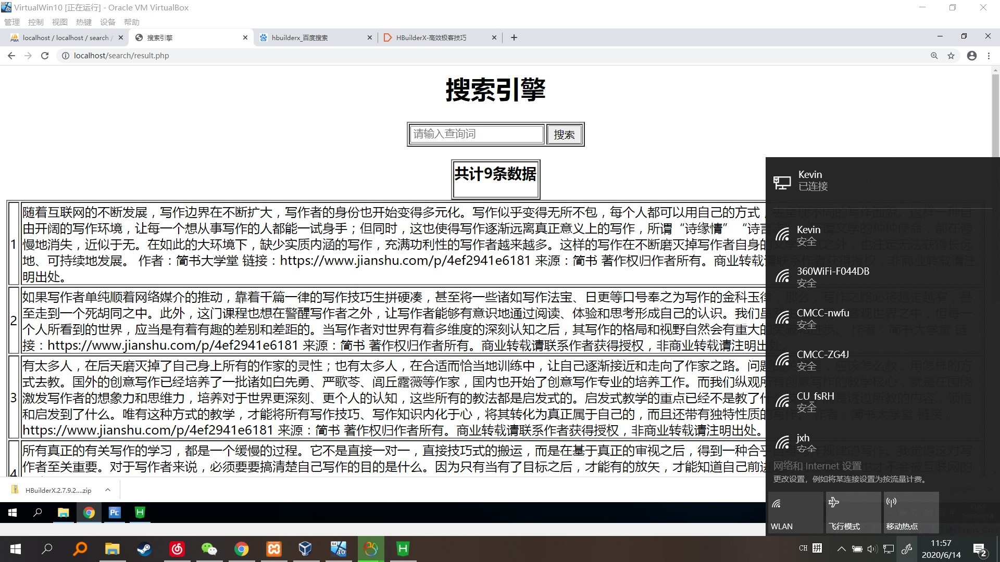

### 基于MySQL全文索引构建简单的中文"搜索引擎"
#### 实验代码
index.html
```
<html>
<head>
<meta http-equiv="Content-Type" content="text/html; charset=utf-8" />
<title>搜索引擎</title>
</head>
<body>

<h1 align="center">搜索引擎</h1>
<form action="result.php" method="post">
    <table border=1 title="SEARCH" style='margin:0 auto;'>
        
        <tr>
            <td>
               <input type="text" name="searchterm" placeholder="请输入查询词" />
            </td>
            <td><button type="submit">搜索</button>
        </tr>
    </table>
</form> 
```
result.php
```
<html>
<head>
<meta http-equiv="Content-Type" content="text/html; charset=utf-8" />
<title>搜索引擎</title>
</head>
<body>

<h1 align="center">搜索引擎</h1>
<form action="result.php" method="post">
    <table border=1 title="SEARCH" style='margin:0 auto;'>
        
        <tr>
            <td>
               <input type="text" name="searchterm" placeholder="请输入查询词" />
            </td>
            <td><button type="submit">搜索</button>
        </tr>
    </table>
</form> 

<?php
   $dbhost = 'localhost:3306';  //mysql服务器主机地址
   $dbuser = 'root';      //mysql用户名
   $dbpass = 'root';//mysql用户名密码
   $conn = mysqli_connect($dbhost, $dbuser, $dbpass);
   if(! $conn )
   {
     die('Could not connect: ' . mysqli_error());
   }
   
   mysqli_select_db( $conn,'search' );
   mysqli_query($conn,"set names utf8");
   
   @$searchterm =$_POST['searchterm'];
   $sql = "select * from content 
			where match(content) against ('%$searchterm%')";
   $huoqu = mysqli_query($conn,$sql, MYSQLI_STORE_RESULT );

   $num = mysqli_num_rows($huoqu);
        print '<table border=1 style="margin:0 auto;">';
        print '<tr><td><h3>共计'.$num.'条数据</h3></td></tr>';
        print '</table>';

	 echo "<table border='1' style='margin:0 auto;'>";
	 $i=1;
    while ($row = mysqli_fetch_array($huoqu, MYSQLI_ASSOC)) {
            
            echo "<tr style='margin:0 auto;'>";
			echo "<td>".$i."</td>";
            echo "<td>".$row['content']."</td>";
            echo "</tr>";
            $i=$i+1;
            }  
    echo "</table>\n";
   mysqli_close($conn);
?>
</body>
</html>
```
#### 实验结果截图

#### 实验思路和心得
  本项目包括两个文件，一个是搜索首页index.html，一个是结果页result.php。主要操作逻辑为，用户在表单框内输入关键词，点击搜索，网页会从数据库中查找含有关键词的词条并显示在页面上。
  为了简单起见，数据库采用了最简单的形式，只有id和中文内容，建表代码如下：
```
CREATE TABLE content(
    id INT AUTO_INCREMENT NOT NULL PRIMARY KEY  ,
    content text  ,
    FULLTEXT(title, body) WITH PARSER ngram
) engine=InnoDB;;
```
  其中id为主键，content上创建了全文索引，使用了mysql自带的ngram分词解析器。engine使用了InnoDB。
  连接数据库：
```
$dbhost = 'localhost:3306';  //mysql服务器主机地址
   $dbuser = 'root';      //mysql用户名
   $dbpass = 'root';//mysql用户名密码
   $conn = mysqli_connect($dbhost, $dbuser, $dbpass);
   if(! $conn )
   {
     die('Could not connect: ' . mysqli_error());
   }
   
   mysqli_select_db( $conn,'search' );
   mysqli_query($conn,"set names utf8");
```
  查询代码：
```
@$searchterm =$_POST['searchterm'];
   $sql = "select * from content 
			where match(content) against ('%$searchterm%')";
   $huoqu = mysqli_query($conn,$sql, MYSQLI_STORE_RESULT );
```
  最后输出结果即可。
  本次项目中最大的困难是中文全文检索的实现，InnoDB默认的全文索引parser非常合适于Latin，因为Latin是通过空格来分词的。但对于像中文，日文和韩文来说，没有这样的分隔符。一个词可以由多个字来组成，所以我们需要用不同的方式来处理。在MySQL 5.7.6中我们能使用一个新的全文索引插件来处理它们：n-gram parser。
  但在使用过程中我发现，ngram无法正常使用。经过调查，我终于找到了原因。由于我们上课时使用的是XAMPP，XAMPP中的mysql其实是mariadb，两者有一定的差别，在mariadb中并没有更新ngram插件（即使是10.4版本），所以XAMPP无法使用这一功能。所以本项目的实现使用了虚拟机，我在虚拟机中使用phpcustom重新配置了新的环境，使用了mysql 8.0。中文全文索引便可正常使用了。
  
  
  
  
  
  
  
  
  
  
  
  
  
  
  
  
